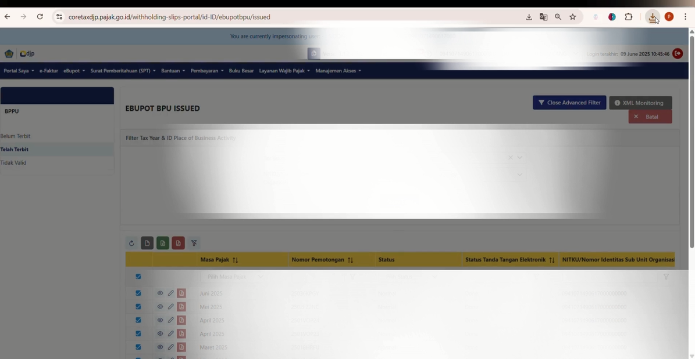
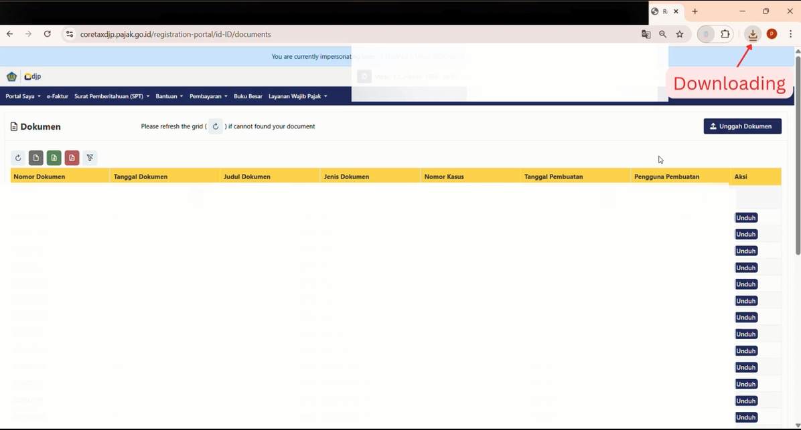

# Coretax Auto Downloader

🚀 **Coretax Auto Downloader** adalah kumpulan ekstensi Chrome yang dibuat untuk mempermudah proses **download bukti potong pajak** dari platform **Coretax**.  
Dengan ekstensi ini, proses yang biasanya manual dan memakan waktu dapat dilakukan secara otomatis, cepat, dan efisien.  

## 📌 Fitur Utama
- **Otomatisasi download bukti potong pajak** langsung dari website Coretax.
- Mendukung dua jenis bukti potong:
  - **Unfikasi 1,3T** → Download file bukti potong unifikasi secara otomatis.  
  - **Prepaid 10T** → Download file bukti potong dari lawan transaksi (prepaid).  
- Ringan, mudah digunakan, tanpa konfigurasi rumit.
- Dibuat untuk profesional pajak yang ingin menghemat waktu dalam pekerjaan sehari-hari.

## 💻 Instalasi
1. Clone repository ini atau download sebagai ZIP.
   ```bash
   git clone https://github.com/dirgarahman/coretax-auto-downloader.git
   ```
2. Buka **Google Chrome** lalu pergi ke:
   ```
   chrome://extensions
   ```
3. Aktifkan **Developer Mode** (kanan atas).
4. Klik **Load unpacked** dan pilih folder:
   - `coretax unfikasi 1,3T` untuk ekstensi Unfikasi.  
   - `coretax prepaid 10T` untuk ekstensi Prepaid.  

## ▶️ Cara Penggunaan
1. Login ke website Coretax seperti biasa.  
2. Jalankan ekstensi sesuai kebutuhan:
   - **Unfikasi 1,3T** → otomatis mendownload bukti potong unifikasi.  
   - **Prepaid 10T** → otomatis mendownload bukti potong dari lawan transaksi.  
3. File hasil download akan tersimpan di folder default browser (biasanya `Downloads`).  

## 🎥 Demo Video

### Coretax Unfikasi 1,3T
[](assets/demo1,3T.mp4)

### Coretax Prepaid 10T
[](assets/demo10T.mp4)

## 📌 Roadmap / Pengembangan
- [ ] Menambahkan opsi konfigurasi folder download.  
- [ ] Mendukung format ekspor tambahan (CSV/Excel).  
- [ ] Optimasi UI untuk Prepaid Extension.  

## 🤝 Kontribusi
Proyek ini terbuka untuk siapa saja yang ingin berkontribusi.  
Silakan buat **pull request** atau ajukan **issue** jika menemukan bug atau ide baru.  

## 📄 Lisensi
Lisensi mengikuti masing-masing folder (`LICENSE`).  
Default: MIT License.  

---

✨ Dibuat oleh **Dirga Rahman**
